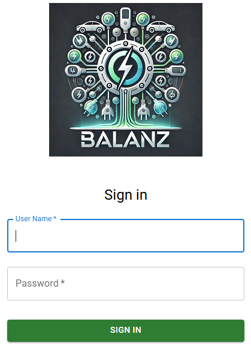
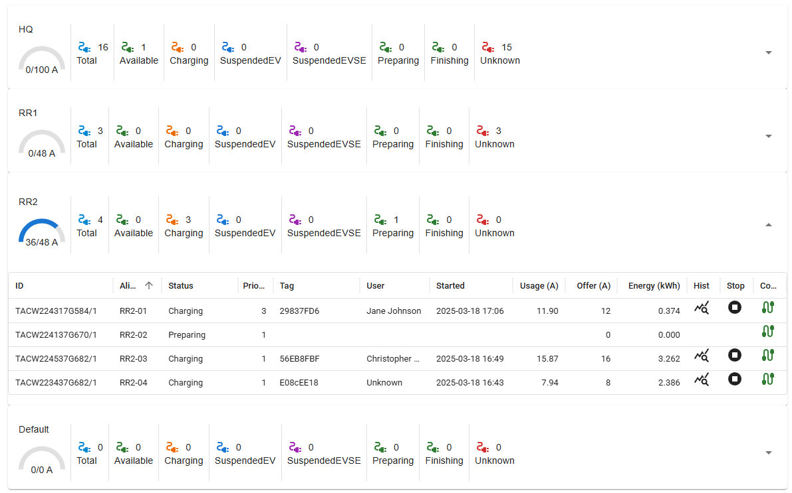
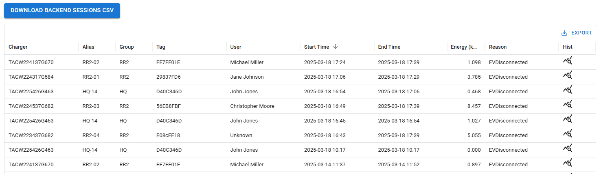
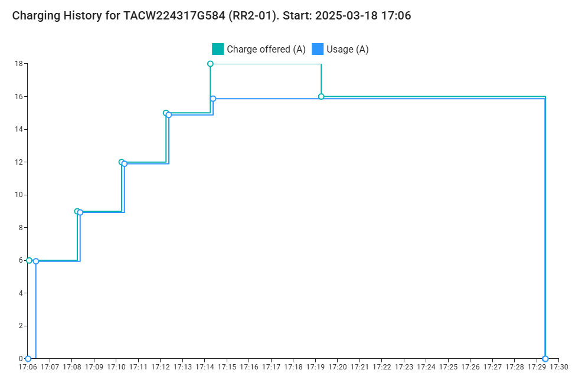
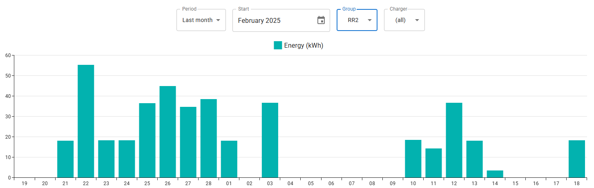
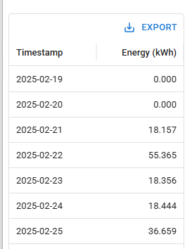
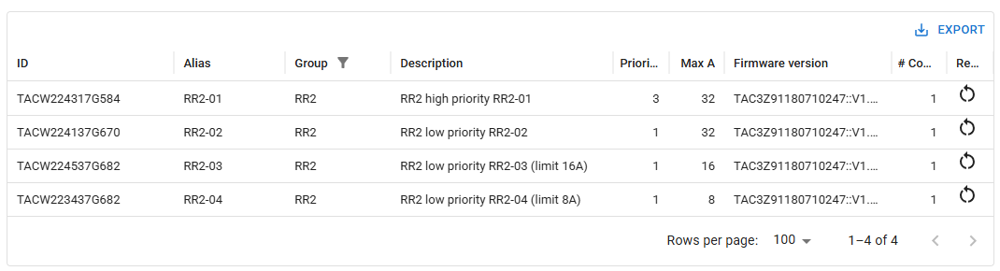
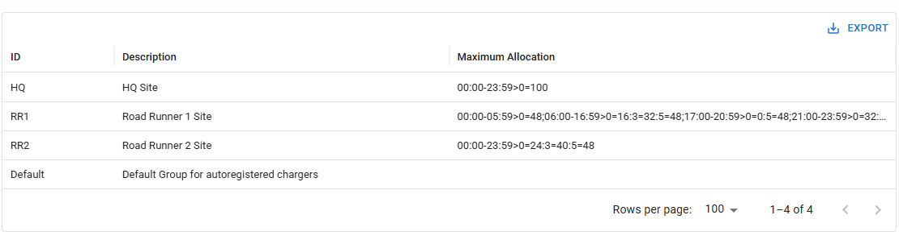
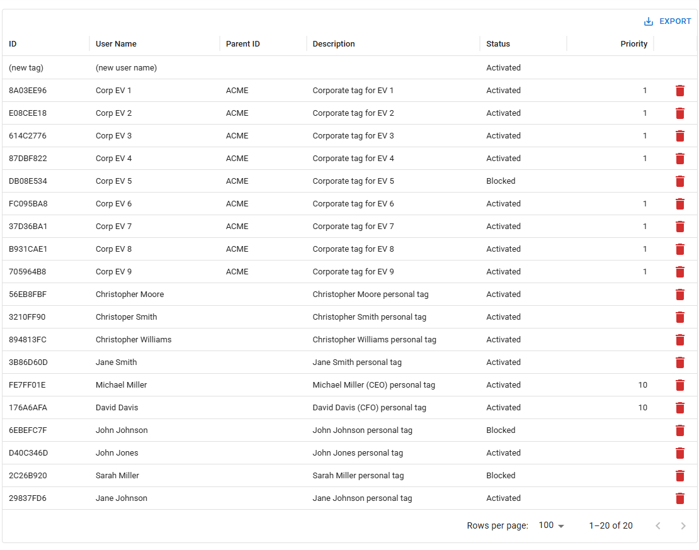
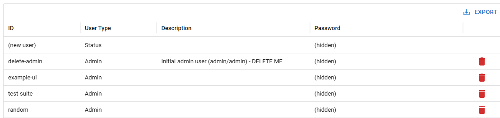

UI
==

:term:`balanz` includes a UI allowing control of - almost - all functions. The UI runs in a web browser on a computer,
but some screens are even suitable for basic viewing and interaction on mobile devices.

This section will brief outdescribe the main elements on the UI which is otherwise meant to be self-explanatory.

The UI communicates with :term:`balanz` via the API, i.e. on the same web socket connection used by the chargers. The UI itself
may be served by any standard web server. UI building and deployment is described in the repository ``README.md`` file.

.. note::
  As mentioned above, the UI does not give access to all API functions. Excluded are some low level application functions like
  changing log levels, some low-level OCPP commands, etc. One way of performing these function is using very basic UI (single HTML
  page) included in the ``examples`` folder in :term:`balanz`.

Screens
-------

The UI starts out displaying a Login screen as shown below. Upon :term:`balanz` installation, a default administrator user has been
created (user name ``admin`` and password ``admin``). This user should be deleted and new user(s) created.

  Login screen

Once succesfully logged in a top toolbar appears giving access to 7 main screens. The STATUS screen is the default screen and will be 
automatically selected.

  Toolbar

The screens are:

  - STATUS - Shows current status of all chargers, split by group, including their state, energy consumption, etc. Depending on 
    user type, charging priority for a session may be changed and sessions remotedly terminated.
  - SESSIONS - Gives a tabular view of completed sessions. Allows filtering and CSV export.
  - STATISTICS - Graphical statistical view on energy consumption per time (hoursly, daily, monthly). Filtering by group or even charger.
  - CHARGERS - Tabular view of all chargers. Details may be edited. Supports chargers reset.
  - GROUPS - Tabular view of groups. Details, including smart charging details, may be edited.
  - TAGS - Tabular view of all tags. Details may be edited and tages created or deleted.
  - USERS - User administration. Create, edit, delete.

.. note::
  Not all screens and functions are available to all user types. Only the ``Admin`` user type has access to all screens, while ``Status`` 
  users can only access the STATUS screen (but not change anything).

Status Screen
-------------

The status screen displays each group in `accordion` style, i.e. a box with basic information which can be expanded into a table showing each
charger connector in its own row. For each group, basic information about the current total offered power (in A) vs. the available total
is shown as gauge. This is followed by a split of connectors by their charging status.

Referring to the example below (click to expand), the group ``RR2`` has been expanded to show its four chargers (each with a single connector). 
Detailed information about charging status is presented along the columns. The table (like all tables in the UI) may be sorted
and filtered by any column. 

At the end of each row, three icons are displayed. The first will open a popup windows displaying the charging history. The second allows
an ongoing session to be remotely stopped, while the third icon will indicate by its color the network connectivty status of the charger 
(i.e. whether the charger is currently connected to :term:`balanz`).

If the user has appropriate permissions, the ``Priority`` column is editable when a session is ongoing. A priority change takes effect
immediately for that session, but reverts to the charger default once the charging session is complete.

  Status screen

Sessions Screen
---------------

This screen allows access to historic sessions in tabular form, see example below (again, click to expand). Here, filtering and sorting is
especially appropriate for detailed analysis. Once selected, filtered rows may be exported as CSV. 

A separate button for CSV export is available above the table. This will download the :term:`balanz` ``sessions.csv`` file as is for direct analysis.

  Sessions screen

It is also possible to see the charging history by clicking on the appropriate icon in in right-most column - see example below.

  Charging History Popup

Statistics Screen
-----------------

This screen allows for graphical analysis (a bar chart) showing energy charged over time (hours, days, months, years). Filtering by group is 
available. In the example below (click to expand), RR2 energy per day in the last month is shown.

  Statistics graph

Data shown in the bar chart is replicated in a table below the chart. The table includes as well a total. Table contents is available for
export to a CSV file if so desired. See example below.

  Statistics table

Chargers Screen
---------------

This screen shows all chargers known to the system. Details like description, maximum current, and default priority may be edited from here.
As well, it is possible to request a charger reset (hard or soft) by clicking on the ``Reset`` icon in the right-most column. A pop-up confirming
the action (chose between soft and hard reset, or cancel) will appear.

Below example shows chargers filtered by the ``RR2`` group.

  Chargers screen

Groups Screen
--------------

Here all groups are shown. It is possible to update group description as well as ``Maximum Allocation`` field driving the Smart Charging logic
for allocation groups. See examle below.

  Groups screen

Tags Screen
-----------

On the Tags screen, tags may be created, deleted or edited. By editing the ``Status`` column, a tag may be marked as ``Blocked`` or ``Activated``.
It is also possible to set a tag specific ``Priority`` value; this will override the default priority set on the charger.

Example below.

  Tags screen

Users Screen
------------

The final screen is the Users Screen which is available only to Admin users. Here, users may be create or deleted. It is also possible to update
the password associated with a user. Note, that passwords are not stored in :term:`balanz` (only the hash of the user name and password is stored for 
authentication purposes). 

  Users screen
